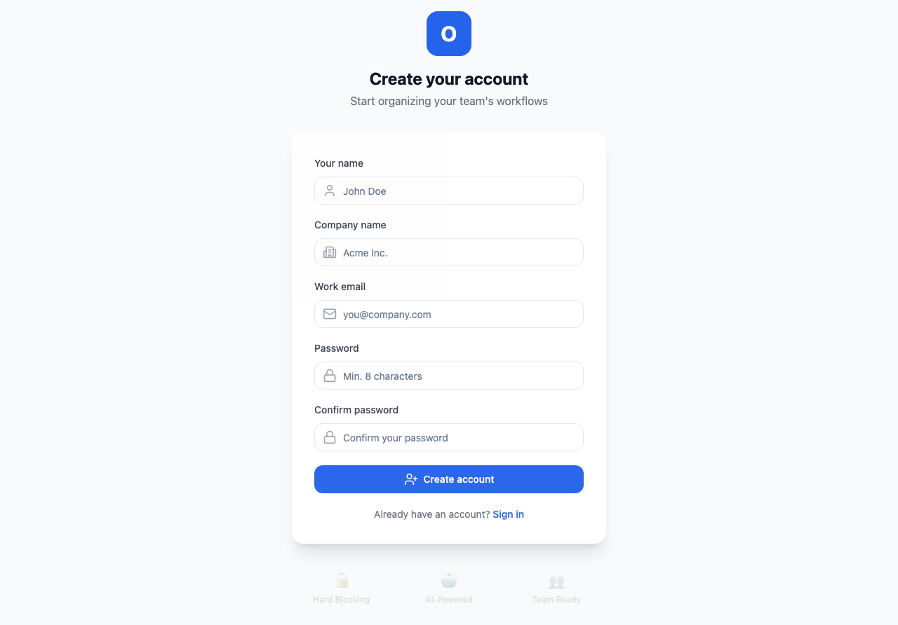
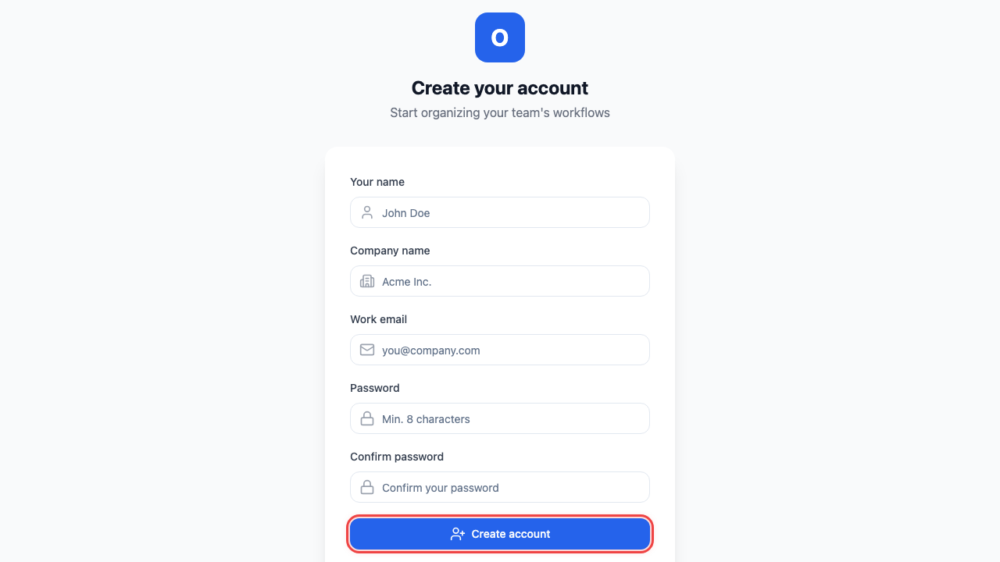
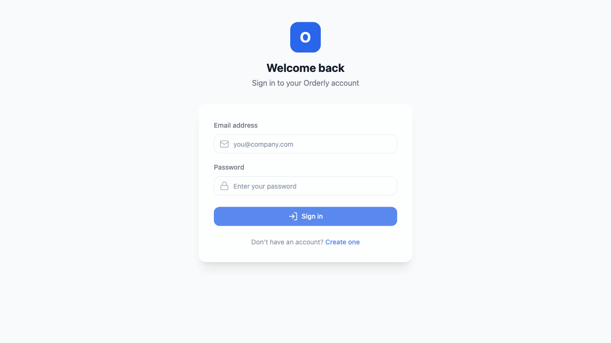
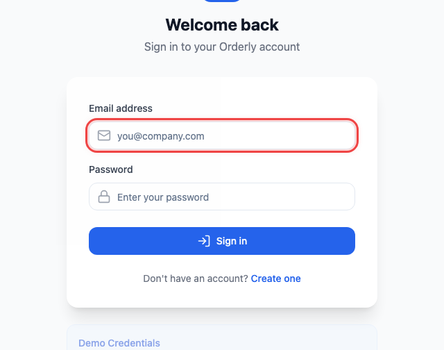
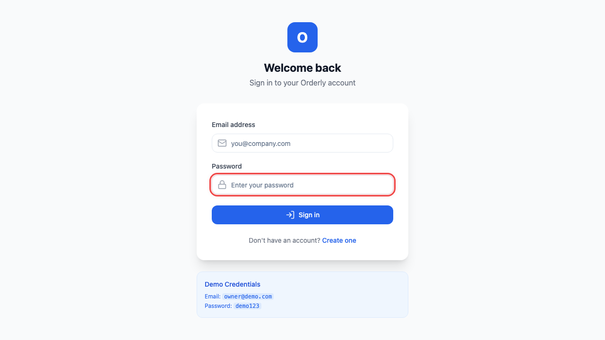
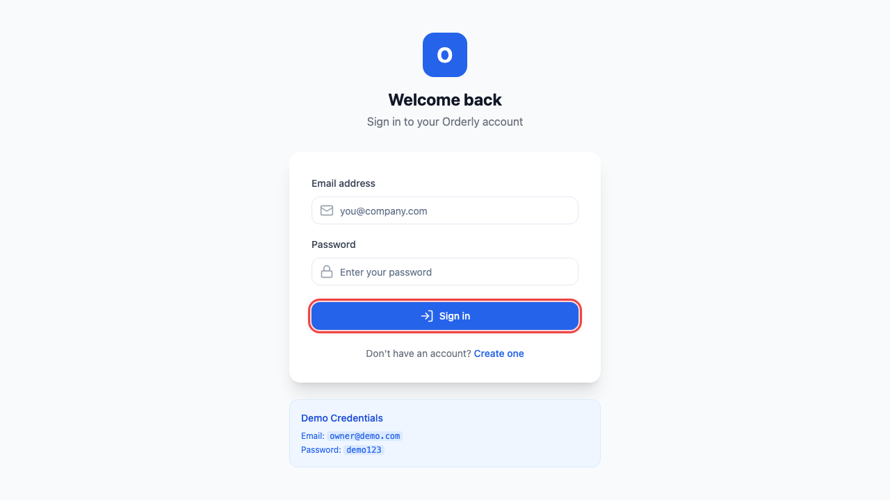

# Getting Started with Orderly

Welcome to Orderly - your process enforcement platform that ensures tasks are completed in the right order, every time.

## Table of Contents

- [Overview](#overview)
- [Account Setup](#account-setup)
  - [Creating a New Account (Founder)](#creating-a-new-account-founder)
  - [Joining an Existing Organization (Manager/Team Member)](#joining-an-existing-organization)
- [Logging In](#logging-in)
- [First Steps After Login](#first-steps-after-login)
- [User Roles Explained](#user-roles-explained)
- [Troubleshooting](#troubleshooting)

---

## Overview

Orderly is a **Hard Blocking Workflow Engine** that physically prevents tasks from executing out of order. This ensures your processes are followed correctly every time.

**Key Concepts:**
- **Playbooks**: Reusable workflow templates (like recipes for processes)
- **Workflow Instances**: Active executions of a playbook
- **Tasks**: Individual steps within a workflow
- **Hard Blocking**: Tasks remain locked until their dependencies are complete

---

## Account Setup

### Creating a New Account (Founder)

If you're setting up Orderly for your organization, follow these steps:

**Step 1: Navigate to the Registration Page**

Open your browser and go to the Orderly application. Click on **"Sign Up"** or **"Register"**.

**Step 2: Enter Your Organization Details**

Fill in the registration form with your organization information:

| Field | Description | Example |
|-------|-------------|---------|
| **Organization Name** | Your company or team name | "Crescendo Digital" |
| **Your Name** | Your full name | "Alex Chen" |
| **Email** | Your work email address | "alex@crescendo.io" |
| **Password** | A secure password (min 8 characters) | ••••••••• |

*Enter your organization name in the highlighted field*

*Enter your email address*

**Step 3: Create Your Account**

Click the **"Create Account"** or **"Sign Up"** button to complete registration.

*Click the highlighted button to create your account*

> **Note for Founders:** As the account creator, you will automatically be assigned the **Owner** role with full administrative privileges.

---

### Joining an Existing Organization

If your organization already uses Orderly and you've been invited:

1. Check your email for an invitation link from Orderly
2. Click the invitation link
3. Complete the registration form with your personal details
4. You'll be added to your organization with the role assigned by your admin

---

## Logging In

**Step 1: Navigate to the Login Page**

Go to the Orderly application login page.

**Step 2: Enter Your Credentials**

Enter your registered email address and password:

*Enter your registered email address*

*Enter your password*

**Step 3: Click Sign In**

Click the **"Sign In"** button to access your dashboard.

*Click the highlighted button to sign in*

---

## First Steps After Login

After logging in, you'll be taken to your **Dashboard**. Here's what each user role typically does first:

### For Founders/Owners

1. **Create your first Playbook** → Go to [Creating Playbooks](./03-playbooks.md#creating-a-playbook)
2. **Invite your team** → Go to [Team Management](./08-team-management.md)
3. **Set up departments/tags** → Go to [Tags & Organization](./09-tags-organization.md)

### For Managers

1. **Review assigned playbooks** → Go to [Playbooks](./03-playbooks.md)
2. **Start workflow instances** → Go to [Running Workflows](./04-workflows.md)
3. **Assign tasks to team** → Go to [Task Assignment](./05-tasks.md#assigning-tasks)

### For Team Members

1. **Check My Tasks** → Go to [My Tasks](./05-tasks.md#my-tasks)
2. **Complete assigned work** → Go to [Completing Tasks](./05-tasks.md#completing-a-task)
3. **View workflow progress** → Go to [Workflow Status](./04-workflows.md#viewing-progress)

---

## User Roles Explained

Orderly has three main user roles:

| Role | Description | Key Permissions |
|------|-------------|-----------------|
| **Owner/Founder** | Organization administrator | Create playbooks, manage users, view analytics, full access |
| **Manager/Admin** | Team lead or department head | Create playbooks, start workflows, assign tasks, view team progress |
| **Member** | Individual contributor | View assigned tasks, complete tasks, view relevant workflows |

### Permission Matrix

| Action | Owner | Manager | Member |
|--------|-------|---------|--------|
| Create Playbooks | ✅ | ✅ | ❌ |
| Start Workflow Instances | ✅ | ✅ | ❌ |
| Complete Own Tasks | ✅ | ✅ | ✅ |
| Assign Tasks to Others | ✅ | ✅ | ❌ |
| Invite New Users | ✅ | ❌ | ❌ |
| View All Analytics | ✅ | ✅ (Team only) | ❌ |
| Manage Tags/Departments | ✅ | ❌ | ❌ |

---

## Troubleshooting

### Common Login Issues

<strong>I forgot my password</strong>

1. Click **"Forgot Password"** on the login page
2. Enter your registered email address
3. Check your email for reset instructions
4. Follow the link to create a new password

<strong>I'm not receiving the verification email</strong>

1. Check your spam/junk folder
2. Verify you entered the correct email address
3. Wait a few minutes and try again
4. Contact your organization admin if issues persist

<strong>I see "Invalid credentials" error</strong>

1. Verify your email address is correct
2. Check that Caps Lock is not enabled
3. Try resetting your password
4. Contact support if the issue continues

<strong>I'm locked out of my account</strong>

After multiple failed login attempts, your account may be temporarily locked.
Wait 15 minutes before trying again, or contact your organization admin.

---

## Next Steps

Now that you're logged in, continue to:

- **[Understanding the Dashboard](./02-dashboard.md)** - Learn to navigate your workspace
- **[Creating Playbooks](./03-playbooks.md)** - Build your first workflow template
- **[Running Workflows](./04-workflows.md)** - Start executing processes
- **[Managing Tasks](./05-tasks.md)** - Work with individual tasks

---

*Need help? Contact your organization admin or visit our [FAQ](./10-faq.md).*
