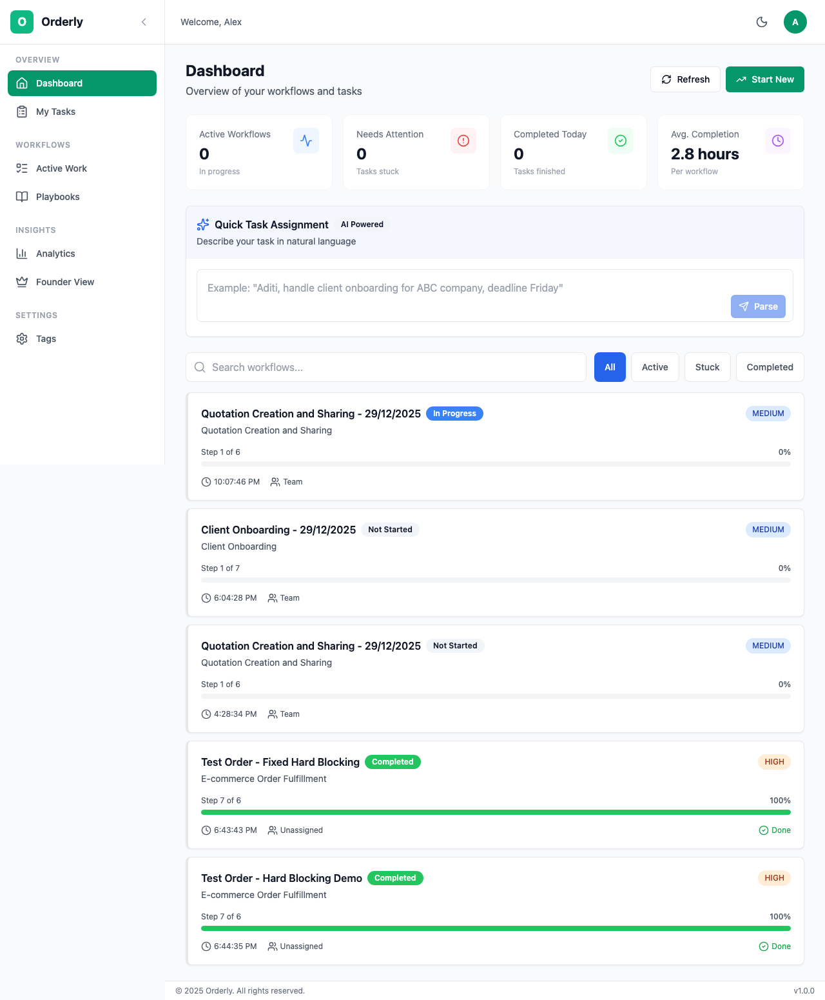
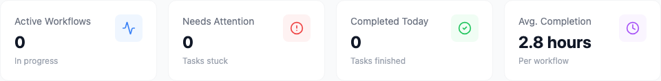
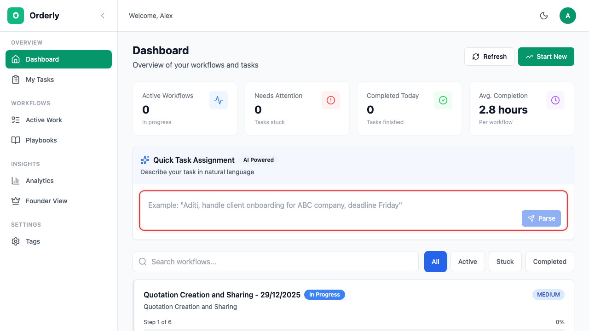
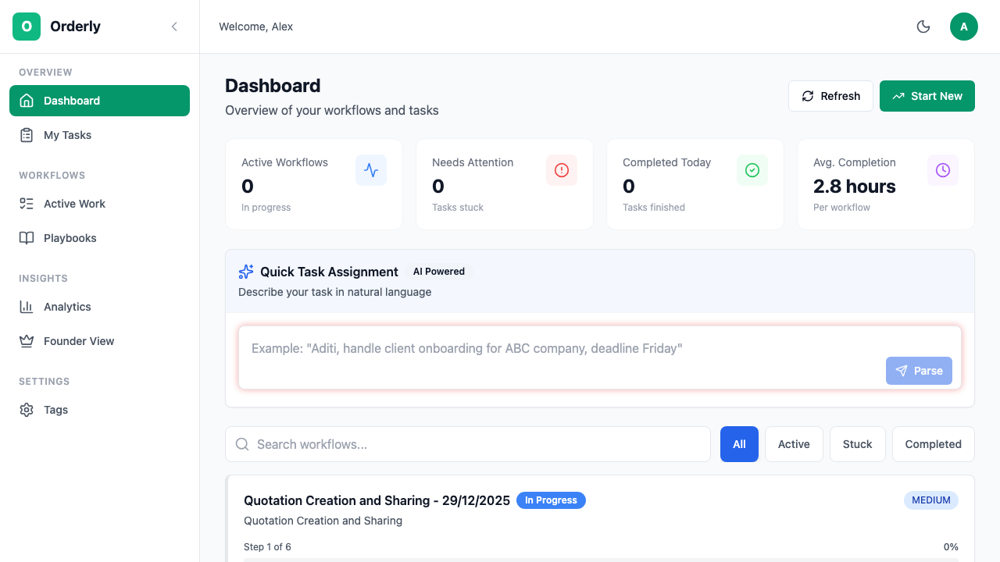
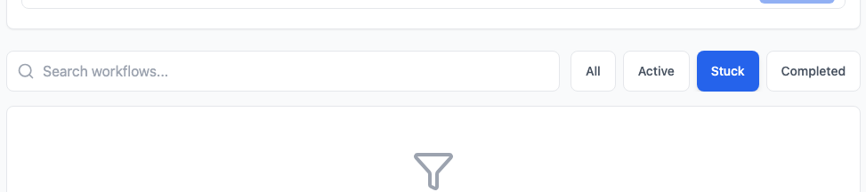
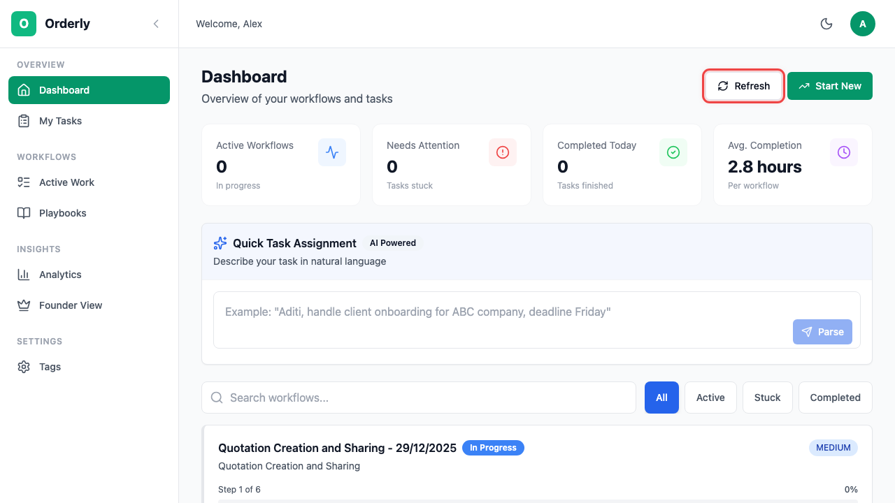

# Dashboard

The Dashboard is your command center in Orderly - giving you a complete overview of all workflows, tasks, and key metrics at a glance.

## Table of Contents

- [Overview](#overview)
- [Navigation](#navigation)
  - [Sidebar Navigation](#sidebar-navigation)
  - [Mobile Navigation](#mobile-navigation)
- [Dashboard Components](#dashboard-components)
  - [Stats Cards](#stats-cards)
  - [AI Command Input](#ai-command-input)
  - [Workflow List](#workflow-list)
- [Filtering & Search](#filtering--search)
- [Quick Actions](#quick-actions)
- [Role-Specific Views](#role-specific-views)

---

## Overview

When you log in to Orderly, you land on the Dashboard. This is your central hub for:

- Viewing key performance metrics
- Starting new workflows with AI assistance
- Monitoring active workflow instances
- Quickly accessing stuck or urgent tasks

*The Orderly Dashboard showing stats, AI command input, and workflow list*

---

## Navigation

### Sidebar Navigation

The left sidebar provides quick access to all main sections of Orderly.

*Desktop sidebar with navigation sections*

**Navigation Sections:**

| Section | Pages | Description |
|---------|-------|-------------|
| **OVERVIEW** | Dashboard, My Tasks | Your personal command center |
| **WORKFLOWS** | Active Work, Playbooks | Manage workflow instances and templates |
| **INSIGHTS** | Analytics | Reports and performance metrics |

**Sidebar Controls:**
- Click the **chevron icon** (◀) to collapse the sidebar for more screen space
- Click the **Orderly logo** to return to the Dashboard from any page
- Hover over icons when collapsed to see tooltips

### Mobile Navigation

On mobile devices, navigation appears at the bottom of the screen as a tab bar.

**Mobile Nav Items:**
- **Home** - Dashboard
- **Tasks** - My Tasks
- **Work** - Active Workflows
- **Playbooks** - Workflow Templates
- **Analytics** - Reports

---

## Dashboard Components

### Stats Cards

At the top of the Dashboard, four stats cards give you instant insight into your workflow status.

*Dashboard statistics cards*

| Card | Icon | What It Shows |
|------|------|---------------|
| **Active Workflows** | 📊 | Number of workflows currently in progress |
| **Needs Attention** | ⚠️ | Tasks that are stuck or blocked unexpectedly |
| **Completed Today** | ✅ | Tasks finished in the current day |
| **Avg. Completion** | ⏱️ | Average time to complete a workflow |

> **Tip:** Click the **Refresh** button in the header to update these stats in real-time.

### AI Command Input

The AI Command Input allows you to create new workflows using natural language.

*AI-powered workflow creation input*

**How to Use:**

1. Click on the command input field
2. Type a description of your process in plain English
3. Click **Generate** or press Enter

**Example Prompts:**
- "Create an employee onboarding workflow with IT setup, HR paperwork, and manager introduction"
- "Build a content approval process with draft review, legal check, and final publishing"
- "Set up a bug fix workflow with triage, development, QA, and deployment stages"

The AI will generate a complete workflow with:
- Logical step sequences
- Proper dependencies (hard blocking)
- Suggested time estimates
- Default assignees

### Workflow List

Below the stats and AI input, you'll see a list of all your workflow instances.

**Each Workflow Card Shows:**
- Workflow title and template name
- Current status (Active, Stuck, Completed)
- Progress bar showing completion percentage
- Number of completed vs total tasks
- Priority level indicator
- Time since last activity

**Status Indicators:**

| Status | Color | Meaning |
|--------|-------|---------|
| **Active** | 🔵 Blue | Workflow is progressing normally |
| **Stuck** | 🔴 Red | A task is blocked or overdue |
| **Completed** | 🟢 Green | All tasks finished |

---

## Filtering & Search

Use the filter and search controls to quickly find specific workflows.

*Search and filter options*

### Search

Type in the search box to filter workflows by:
- Workflow instance title
- Template (playbook) name

### Filter Buttons

Click filter buttons to show only certain workflow statuses:

| Filter | Shows |
|--------|-------|
| **All** | Every workflow instance |
| **Active** | Workflows in progress |
| **Stuck** | Workflows with blocked tasks |
| **Completed** | Finished workflows |

*Dashboard filtered to show only stuck workflows*

---

## Quick Actions

### Header Actions

*Dashboard header with action buttons*

| Button | Action |
|--------|--------|
| **Refresh** | Reload all data from the server |
| **Start New** | Navigate to Playbooks to start a new workflow |

### Mobile Quick Action

On mobile, a floating action button appears in the bottom-right corner. Tap this button to quickly access Analytics or start a new workflow.

---

## Role-Specific Views

### For Founders/Owners

As a Founder, your Dashboard focuses on:

1. **Organization-wide metrics** - See all workflows across all teams
2. **Stuck workflows** - Quickly identify bottlenecks
3. **Team productivity** - Monitor completion rates

**Recommended Actions:**
- Review "Needs Attention" count daily
- Use filters to focus on stuck workflows
- Click through to Analytics for deeper insights

### For Managers

As a Manager, your Dashboard shows:

1. **Team workflows** - Instances your team is working on
2. **Task distribution** - Who's working on what
3. **Progress tracking** - Are workflows on schedule?

**Recommended Actions:**
- Start each day by checking Active Workflows
- Use AI Command Input to quickly create new workflows
- Monitor stuck tasks and reassign if needed

### For Team Members

As a Team Member, your Dashboard displays:

1. **Assigned workflows** - Instances you're part of
2. **Your task count** - How many tasks need your attention
3. **Recent completions** - Your contribution today

**Recommended Actions:**
- Check "Completed Today" for motivation
- Click on workflows to see your assigned tasks
- Use "My Tasks" in the sidebar for a focused view

---

## Keyboard Shortcuts

| Shortcut | Action |
|----------|--------|
| `Cmd/Ctrl + K` | Focus AI Command Input |
| `Cmd/Ctrl + R` | Refresh dashboard data |
| `/` | Focus search input |

---

## Next Steps

- **[Playbooks](./03-playbooks.md)** - Learn to create workflow templates
- **[Running Workflows](./04-workflows.md)** - Start and manage workflow instances
- **[My Tasks](./05-tasks.md)** - View your personal task list

---

*Need help? Contact your organization admin or visit our [FAQ](./10-faq.md).*
