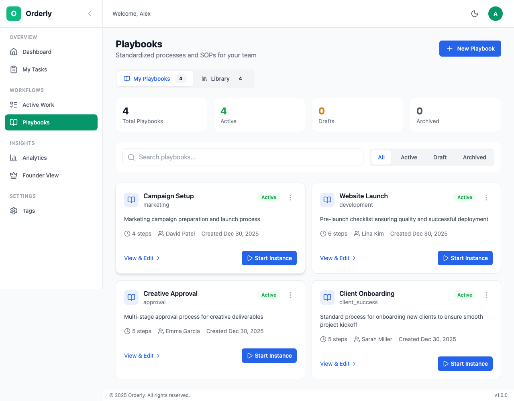
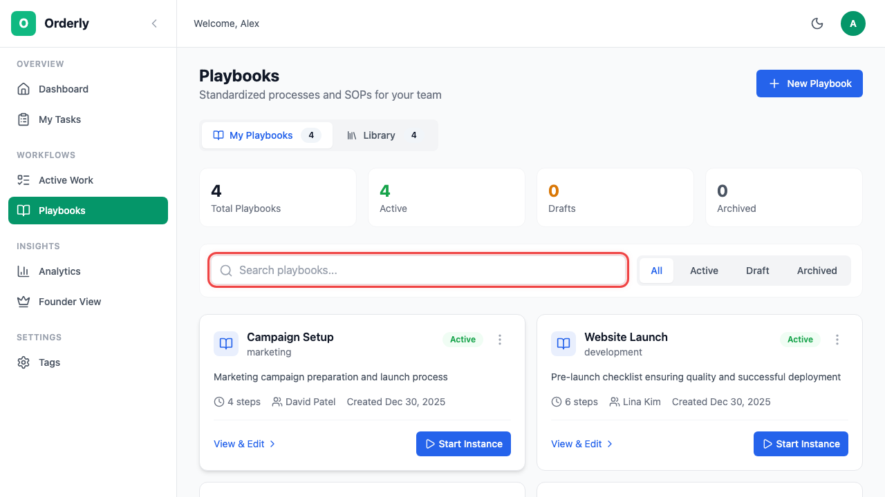
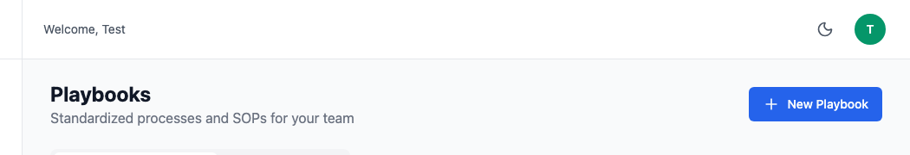
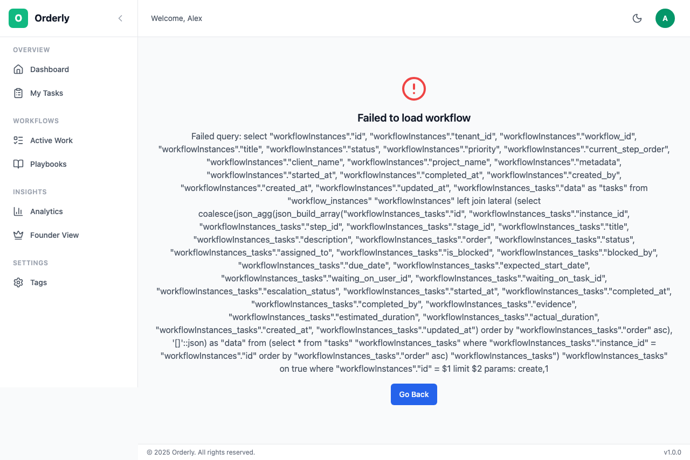

# Playbooks

Playbooks are reusable workflow templates in Orderly. Think of them as recipes for your processes - once created, they can be used to start multiple workflow instances.

## Table of Contents

- [Overview](#overview)
- [Browsing Playbooks](#browsing-playbooks)
  - [My Playbooks](#my-playbooks)
  - [Template Library](#template-library)
- [Creating a Playbook](#creating-a-playbook)
  - [AI-Powered Creation](#ai-powered-creation)
  - [Manual Creation](#manual-creation)
  - [Stage Editor](#stage-editor)
- [Managing Playbooks](#managing-playbooks)
  - [Editing a Playbook](#editing-a-playbook)
  - [Cloning a Playbook](#cloning-a-playbook)
  - [Activating a Playbook](#activating-a-playbook)
  - [Archiving a Playbook](#archiving-a-playbook)
- [Starting a Workflow from a Playbook](#starting-a-workflow-from-a-playbook)
- [Role-Specific Workflows](#role-specific-workflows)

---

## Overview

Playbooks define the structure of your processes:
- **Steps/Tasks**: The individual work items to complete
- **Dependencies**: Which tasks must finish before others can start
- **Stages**: Groups of tasks that can run in parallel
- **Blocking Mode**: How strictly tasks are sequenced


*The Playbooks page showing your workflow templates*

---

## Browsing Playbooks

### My Playbooks

The default tab shows playbooks created by you or your organization.

**Playbook Card Information:**

| Element | Description |
|---------|-------------|
| **Title** | Name of the playbook |
| **Category** | Type of workflow (e.g., Onboarding, Production) |
| **Status Badge** | Draft, Active, or Archived |
| **Step Count** | Number of tasks in the workflow |
| **Created Date** | When the playbook was created |

**Playbook Statuses:**

| Status | Color | Meaning | Can Start Instance? |
|--------|-------|---------|---------------------|
| **Draft** | 🟡 Yellow | Work in progress, not finalized | No |
| **Active** | 🟢 Green | Ready for use | Yes |
| **Archived** | ⚫ Gray | No longer in use | No |

**Filtering Playbooks:**

Use the filter tabs to show specific playbook types:
- **All** - Every playbook
- **Draft** - Playbooks still being developed
- **Active** - Ready-to-use playbooks
- **Archived** - Old or retired playbooks


*Search and filter your playbooks*

### Template Library

Click the **Library** tab to browse pre-made templates from the Orderly marketplace.

**Library Templates Include:**
- Industry-standard processes
- Best practice workflows
- Community-contributed templates

To use a library template:
1. Click on the template card
2. Click **Use This Template**
3. The template is copied to your playbooks as a draft
4. Customize it for your needs

---

## Creating a Playbook

### AI-Powered Creation

The fastest way to create a playbook is using AI. Describe your process in plain English, and Orderly generates the complete workflow.

**Step 1: Navigate to Create Page**

Click the **Create Playbook** button.


*Click to create a new playbook*

**Step 2: Describe Your Process**

Enter a natural language description of your workflow.


*The AI-powered workflow creation page*

**Example Prompts:**

<details>
<summary><strong>Employee Onboarding</strong></summary>

```
Create an employee onboarding workflow with the following stages:
1. Pre-start: Send welcome email, prepare workstation, create accounts
2. Day 1: Office tour, team introduction, HR paperwork
3. Week 1: Training sessions, assign mentor, set up tools
4. Month 1: First project assignment, 30-day check-in
```

</details>

<details>
<summary><strong>Content Publishing</strong></summary>

```
Build a content publishing workflow:
- Content creation (draft article, add images)
- Editorial review (editor review, feedback)
- Legal review (compliance check)
- Final approval (manager sign-off)
- Publishing (schedule post, social media)
```

</details>

<details>
<summary><strong>Bug Fix Process</strong></summary>

```
Create a bug fix workflow with:
1. Triage: Verify bug, assess priority, assign developer
2. Development: Reproduce issue, implement fix, write tests
3. Review: Code review, QA testing
4. Deployment: Stage deployment, production deployment, monitor
```

</details>

**Step 3: Generate & Review**

Click **Generate** to create the workflow. The AI will produce:
- Logical step sequences
- Proper dependencies
- Stage groupings
- Suggested assignees

Click the **Generate** button to create the workflow from your description.

**Step 4: Customize (Optional)**

Review the generated workflow and adjust as needed using the Stage Editor.

### Manual Creation

You can also create playbooks manually:

1. Click **Create Playbook**
2. Select **Start from Scratch**
3. Enter playbook details:
   - Title
   - Description
   - Category
   - Blocking Mode
4. Add steps using the Stage Editor

### Stage Editor

The Stage Editor lets you visually organize your workflow steps into stages.

**Understanding Stages:**

Stages group related tasks together. Based on your **Blocking Mode**:

| Blocking Mode | How It Works |
|---------------|--------------|
| **Fully Sequential** | Tasks unlock one at a time, in order |
| **Stage Sequential** | All tasks in a stage run in parallel; stages are sequential |
| **None** | All tasks available from the start |

**Adding Steps:**

1. Click **Add Step** in a stage
2. Enter step details:
   - **Title**: Name of the task
   - **Description**: What needs to be done
   - **Assignee**: Who should complete it (optional)
   - **Estimated Time**: How long it should take

**Reordering Steps:**

- Drag and drop steps within a stage
- Drag steps between stages
- Drag entire stages to reorder

**Setting Dependencies:**

For complex workflows, you can set explicit dependencies:
1. Click on a step
2. Click **Add Dependency**
3. Select which step(s) must complete first

---

## Managing Playbooks

### Editing a Playbook

1. Find the playbook in your list
2. Click the **⋮** (more options) menu
3. Select **Edit Playbook**

From the playbook card, click the **⋮** (more options) menu to access actions.

You can edit:
- Title and description
- Steps and stages
- Dependencies
- Assignees
- Blocking mode

> **Note:** Editing an active playbook doesn't affect existing workflow instances. Changes only apply to new instances.

### Cloning a Playbook

Create a copy of an existing playbook:

1. Click the **⋮** menu on any playbook
2. Select **Clone Playbook**
3. The clone appears as a new draft

Use cloning to:
- Create variations of a process
- Start from a proven template
- Backup before major changes

### Activating a Playbook

Draft playbooks must be activated before use:

1. Click the **⋮** menu on a draft playbook
2. Select **Activate**
3. Confirm activation

Once active:
- ✅ Can start workflow instances
- ✅ Appears in "Start Workflow" options
- ⚠️ Be careful editing - changes affect new instances

### Archiving a Playbook

When a playbook is no longer needed:

1. Click the **⋮** menu on an active playbook
2. Select **Archive**
3. Confirm archival

Archived playbooks:
- ❌ Cannot start new instances
- ✅ Existing instances continue running
- ✅ Can be unarchived later

---

## Starting a Workflow from a Playbook

Once you have an active playbook, you can start workflow instances:

**Method 1: From Playbook Card**

1. Find an active playbook
2. Click the **Play** button (▶) on the card
3. Enter instance details
4. Click **Start**

**Method 2: From Workflows Page**

1. Go to **Workflows** (Active Work)
2. Find the playbook in **Quick Start**
3. Click **Start**

**Method 3: From Dashboard**

1. Click **Start New** button
2. Select a playbook
3. Configure and start

**Instance Configuration:**

| Field | Description |
|-------|-------------|
| **Title** | Name for this specific execution |
| **Priority** | Low, Medium, High, or Urgent |
| **Assignees** | Override default task assignments |
| **Due Date** | When the workflow should complete |

---

## Role-Specific Workflows

### For Founders/Owners

**Key Playbook Tasks:**

1. **Create organization-wide playbooks**
   - Standardize company processes
   - Ensure compliance with procedures

2. **Manage the playbook library**
   - Archive outdated processes
   - Approve new playbooks from managers

3. **Monitor playbook effectiveness**
   - Check Analytics for completion rates
   - Identify bottlenecks

**Best Practices:**
- Start with 3-5 core processes
- Get team feedback before activating
- Review and update quarterly

### For Managers

**Key Playbook Tasks:**

1. **Create team-specific playbooks**
   - Processes for your department
   - Project-specific workflows

2. **Customize templates**
   - Adapt library templates for your team
   - Adjust assignees and timelines

3. **Train team on playbooks**
   - Walk through new workflows
   - Collect feedback for improvements

**Best Practices:**
- Document your most common processes first
- Keep playbooks focused (5-15 steps)
- Include clear task descriptions

### For Team Members

**Key Playbook Tasks:**

1. **Provide feedback on playbooks**
   - Report unclear steps
   - Suggest improvements

2. **Understand workflow expectations**
   - Review playbook before starting work
   - Know your assigned tasks

3. **Flag issues early**
   - Report if a step is blocked incorrectly
   - Communicate timeline concerns

---

## Keyboard Shortcuts

| Shortcut | Action |
|----------|--------|
| `Cmd/Ctrl + N` | Create new playbook |
| `Cmd/Ctrl + E` | Edit selected playbook |
| `Cmd/Ctrl + D` | Duplicate selected playbook |
| `/` | Focus search input |

---

## Next Steps

- **[Running Workflows](/user-guide/04-workflows.md)** - Start and manage workflow instances
- **[Task Management](/user-guide/05-tasks.md)** - Complete tasks in your workflows
- **[Analytics](/user-guide/07-analytics.md)** - Track playbook performance

---

*Need help? Contact your organization admin or visit our [FAQ](/user-guide/10-faq.md).*
