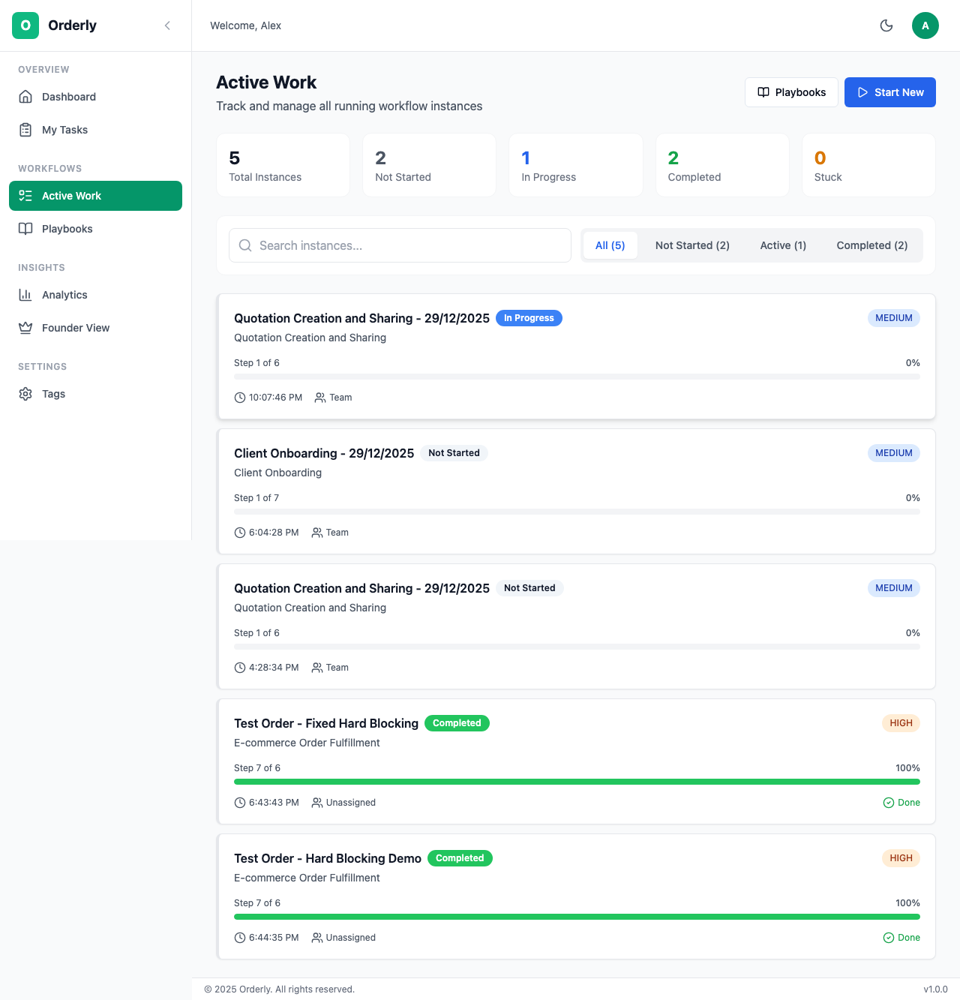
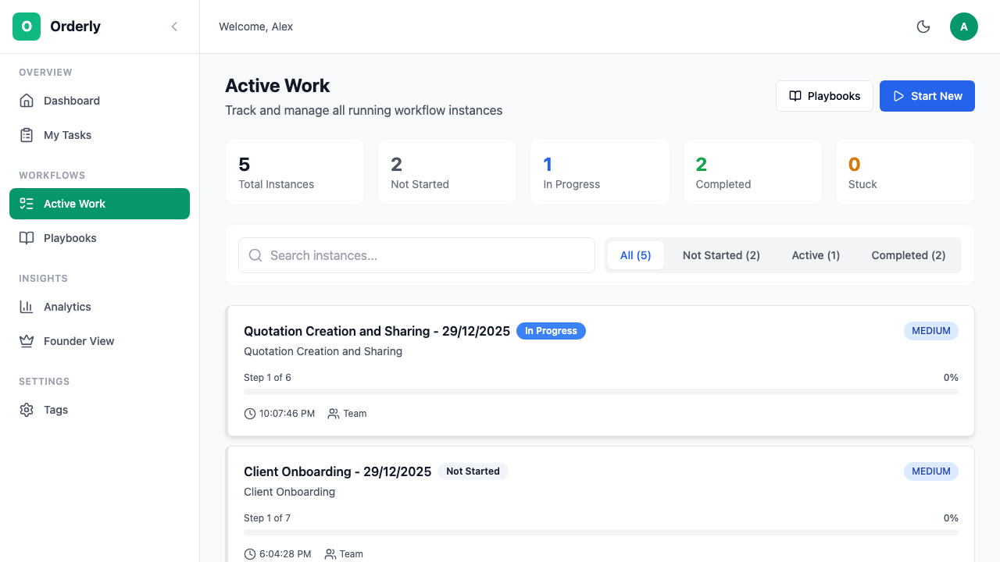

# Workflows (Active Work)

Workflows are live executions of your playbooks. When you start a playbook, it creates a workflow instance that tracks the actual work being done.

## Table of Contents

- [Overview](#overview)
- [Viewing Workflows](#viewing-workflows)
  - [Workflow List](#workflow-list)
  - [View Options](#view-options)
  - [Filtering & Search](#filtering--search)
- [Starting a Workflow](#starting-a-workflow)
  - [Quick Start](#quick-start)
  - [Custom Configuration](#custom-configuration)
- [Workflow Detail Page](#workflow-detail-page)
  - [Progress Tracking](#progress-tracking)
  - [Task List](#task-list)
  - [Flow Diagram](#flow-diagram)
- [Understanding Workflow Status](#understanding-workflow-status)
- [Managing Workflows](#managing-workflows)
- [Role-Specific Workflows](#role-specific-workflows)

---

## Overview

The **Active Work** page shows all running workflow instances in your organization. Here you can:

- View all workflows at a glance
- Start new workflow instances
- Track progress and completion
- Identify stuck or blocked workflows


*The Active Work page showing workflow instances*

---

## Viewing Workflows

### Workflow List

Each workflow instance is displayed as a card with key information:

**Card Information:**

| Element | Description |
|---------|-------------|
| **Title** | Name of this workflow instance |
| **Playbook Name** | The template it was created from |
| **Status Badge** | Current workflow status |
| **Progress Bar** | Visual completion percentage |
| **Task Count** | Completed / Total tasks |
| **Priority** | Low, Medium, High, or Urgent |
| **Last Activity** | Time since last update |

### View Options

Switch between different views using the view toggle buttons at the top of the page.

**Available Views:**

| View | Best For | Description |
|------|----------|-------------|
| **List** | Quick scanning | Vertical list of workflow cards |
| **Kanban** | Status overview | Columns by workflow status |
| **Calendar** | Timeline planning | Calendar view by due date |

#### List View

Best for:
- Quickly scanning many workflows
- Searching and filtering
- Dense information display

#### Kanban View

Columns:
- **Not Started** - Workflows that haven't begun
- **In Progress** - Active workflows
- **Stuck** - Workflows with blocked tasks
- **Completed** - Finished workflows

Best for:
- Visual status overview
- Drag-and-drop organization
- Identifying bottlenecks

#### Calendar View

Best for:
- Timeline planning
- Due date management
- Resource scheduling

### Filtering & Search


*Filter buttons for workflow status*

**Filter Options:**

| Filter | Shows |
|--------|-------|
| **All** | Every workflow instance |
| **Not Started** | Workflows waiting to begin |
| **Active** | In progress and stuck workflows |
| **Completed** | Finished workflows |

**Search:**
Type in the search box to filter by:
- Workflow instance title
- Playbook name

---

## Starting a Workflow

### Quick Start

The fastest way to start a workflow is from the Quick Start section:

The Quick Start section displays your active playbooks for easy access.

1. Find your playbook in Quick Start
2. Click the **▶ Start** button
3. The workflow starts immediately with default settings

### Custom Configuration

For more control over your workflow:

1. Click **Start New Workflow**
2. Select a playbook
3. Configure options:

| Option | Description |
|--------|-------------|
| **Instance Title** | Name for this specific execution |
| **Priority** | Low, Medium, High, Urgent |
| **Due Date** | Target completion date |
| **Assignees** | Override default task assignments |

4. Click **Create Instance**

**Example Instance Titles:**
- "Q4 Marketing Campaign Launch"
- "New Hire: John Smith Onboarding"
- "Bug Fix: Login Page Issue #234"

---

## Workflow Detail Page

Click on any workflow to open the detail page where you can see all tasks and track progress.

### Progress Tracking

The progress bar shows:
- Percentage of tasks completed
- Current status
- Estimated time remaining (if available)

**Progress Calculation:**
```
Progress = (Completed Tasks / Total Tasks) × 100%
```

### Task List

Each task shows:
- **Status icon** - Locked 🔒, Available ⭕, In Progress 🔄, Completed ✅
- **Task title** - What needs to be done
- **Assignee** - Who's responsible
- **Time** - Estimated or actual duration

**Task Status Colors:**

| Status | Icon | Color | Meaning |
|--------|------|-------|---------|
| **Locked** | 🔒 | Gray | Waiting for dependencies |
| **Available** | ⭕ | Blue | Ready to start |
| **In Progress** | 🔄 | Yellow | Currently being worked on |
| **Completed** | ✅ | Green | Finished |
| **Skipped** | ⏭️ | Gray | Intentionally bypassed |

### Flow Diagram

For complex workflows, the flow diagram visualizes task dependencies:

**Reading the Diagram:**
- Nodes represent tasks
- Arrows show dependencies
- Colors indicate status
- Stages are grouped visually

**Interactions:**
- Click a node to select a task
- Zoom and pan to navigate
- Hover for task details

---

## Understanding Workflow Status

| Status | Color | Meaning | Next Action |
|--------|-------|---------|-------------|
| **Not Started** | ⚪ Gray | Created but no tasks begun | Start first task |
| **In Progress** | 🔵 Blue | Active work happening | Continue tasks |
| **Stuck** | 🔴 Red | A task is blocked or overdue | Investigate blocker |
| **Completed** | 🟢 Green | All tasks finished | Archive or review |
| **Cancelled** | ⚫ Black | Terminated early | Review why |

**When Does a Workflow Become "Stuck"?**
- A task is overdue
- A task has been available too long without starting
- An escalation has triggered
- A blocking issue is reported

---

## Managing Workflows

### Task Actions

| Action | When Available | Effect |
|--------|----------------|--------|
| **Start** | Task is Available | Changes to In Progress |
| **Complete** | Task is In Progress | Marks done, unlocks dependents |
| **Skip** | Task is Available | Bypasses task, unlocks dependents |
| **Add Note** | Any time | Adds a comment to the task |

### Workflow Actions

From the workflow detail page, you can:

| Action | Description |
|--------|-------------|
| **View Progress** | See completion stats |
| **Reassign Tasks** | Change task assignees |
| **Add Collaborators** | Invite others to help |
| **Export** | Download workflow data |
| **Cancel** | Terminate the workflow |

### Handling Stuck Workflows

When a workflow is stuck:

1. **Identify the blocker**
   - Check which task is stuck
   - Read any notes or comments

2. **Resolve the issue**
   - Complete the blocking task
   - Skip if not needed
   - Reassign if necessary

3. **Resume progress**
   - Dependent tasks unlock automatically
   - Monitor for further issues

---

## Role-Specific Workflows

### For Founders/Owners

**Key Actions:**
- Monitor organization-wide workflow health
- Identify systemic bottlenecks
- Review completion metrics

**Dashboard Focus:**
- Stuck workflows across all teams
- Average completion times
- Team productivity comparison

### For Managers

**Key Actions:**
- Start workflows for team projects
- Track team member progress
- Reassign tasks as needed
- Handle escalations

**Dashboard Focus:**
- Team's active workflows
- Upcoming deadlines
- Resource allocation

### For Team Members

**Key Actions:**
- View workflows you're part of
- See your assigned tasks
- Complete your work items

**Quick Navigation:**
- Use **My Tasks** for a focused view
- Click workflow cards to see your role
- Check progress on shared projects

---

## Best Practices

### Naming Conventions

Use clear, descriptive instance titles:

| ✅ Good | ❌ Avoid |
|---------|----------|
| "New Hire: Sarah Chen - Jan 2024" | "Onboarding" |
| "Q4 Marketing: Product Launch" | "Campaign" |
| "Bug #456: Cart Total Incorrect" | "Fix" |

### Priority Management

Use priority levels consistently:

| Priority | Use For |
|----------|---------|
| **Urgent** | Customer-blocking issues, deadlines today |
| **High** | Important work due this week |
| **Medium** | Standard workflow (default) |
| **Low** | Nice-to-have, when time permits |

### Keeping Workflows Current

- **Start tasks promptly** when available
- **Complete tasks** as soon as finished
- **Add notes** for context and handoffs
- **Report blockers** early, don't wait

---

## Keyboard Shortcuts

| Shortcut | Action |
|----------|--------|
| `Cmd/Ctrl + N` | Start new workflow |
| `Cmd/Ctrl + F` | Focus search |
| `1` / `2` / `3` | Switch view (List/Kanban/Calendar) |
| `←` / `→` | Navigate between workflows |

---

## Next Steps

- **[Task Management](/user-guide/05-tasks.md)** - Complete your assigned tasks
- **[Team Progress](/user-guide/06-team-progress.md)** - Monitor team performance
- **[Analytics](/user-guide/07-analytics.md)** - Track workflow metrics

---

*Need help? Contact your organization admin or visit our [FAQ](/user-guide/10-faq.md).*
