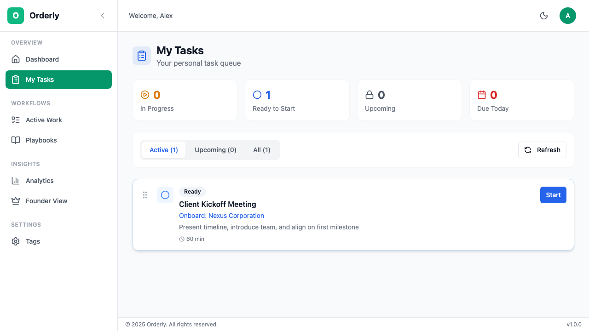
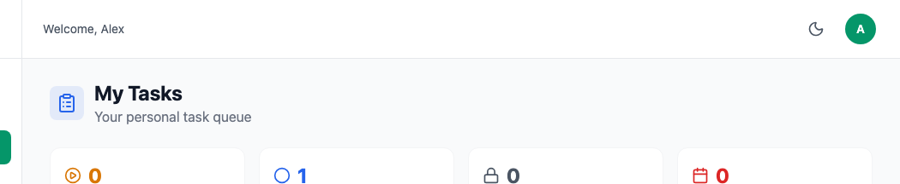

# Task Management

Tasks are the individual work items in Orderly. Each task represents a specific action that needs to be completed as part of a workflow.

## Table of Contents

- [Overview](#overview)
- [My Tasks Page](#my-tasks-page)
  - [Task List](#task-list)
  - [Filtering Tasks](#filtering-tasks)
  - [Reordering Tasks](#reordering-tasks)
- [Understanding Task Status](#understanding-task-status)
  - [The Hard Blocking System](#the-hard-blocking-system)
  - [Status Transitions](#status-transitions)
- [Working with Tasks](#working-with-tasks)
  - [Starting a Task](#starting-a-task)
  - [Completing a Task](#completing-a-task)
  - [Skipping a Task](#skipping-a-task)
- [Task Details](#task-details)
  - [Due Dates & Escalations](#due-dates--escalations)
  - [Task Notes & Comments](#task-notes--comments)
  - [Reassigning Tasks](#reassigning-tasks)
- [Role-Specific Guidance](#role-specific-guidance)

---

## Overview

Tasks in Orderly follow the **hard blocking** principle - tasks remain locked until all their dependencies are completed. This ensures processes are followed in the correct order.


*The My Tasks page showing your assigned work*

---

## My Tasks Page

The **My Tasks** page shows all tasks assigned to you across every workflow.

### Task List

**Task Card Information:**

| Element | Description |
|---------|-------------|
| **Status Icon** | Current task status (Locked, Available, In Progress, Done) |
| **Title** | Name of the task |
| **Workflow** | Which workflow this task belongs to |
| **Due Date** | When the task should be completed |
| **Escalation** | Warning or escalated status if overdue |
| **Actions** | Start, Complete, or Skip buttons |

### Filtering Tasks


*Filter options for tasks*

**Filter Options:**

| Filter | Shows | Count |
|--------|-------|-------|
| **All** | Every task assigned to you | Total |
| **Available** | Tasks ready to start | Ready count |
| **In Progress** | Tasks you're working on | Active count |
| **Completed** | Finished tasks | Done count |

### Reordering Tasks

You can prioritize your work by reordering tasks:

1. **Grab the handle** (⋮⋮) on the left of a task
2. **Drag** to the desired position
3. **Release** to save the new order

> **Note:** Reordering only affects your personal view. It doesn't change the actual workflow dependencies or blocking order.

---

## Understanding Task Status

### The Hard Blocking System

Orderly uses **hard blocking** to enforce process order:

```
🔒 Locked → ⭕ Available → 🔄 In Progress → ✅ Completed
```

| Status | Icon | Meaning | Can I Work on It? |
|--------|------|---------|-------------------|
| **Locked** | 🔒 | Waiting for dependencies | ❌ No |
| **Available** | ⭕ | Ready to start | ✅ Yes |
| **In Progress** | 🔄 | Currently being worked on | ✅ Yes (continue) |
| **Completed** | ✅ | Finished | ❌ Done |
| **Skipped** | ⏭️ | Intentionally bypassed | ❌ Done |

**Why is a task locked?**

A task stays locked until:
- All predecessor tasks are completed
- All tasks it depends on are finished
- The previous stage (if using stage-sequential mode) is complete

### Status Transitions

```
                    ┌─────────────┐
                    │   Locked    │
                    │     🔒      │
                    └──────┬──────┘
                           │ (dependencies complete)
                           ▼
                    ┌─────────────┐
            ┌───────│  Available  │───────┐
            │       │     ⭕      │       │
            │       └──────┬──────┘       │
            │              │              │
            │ (skip)       │ (start)      │
            ▼              ▼              │
     ┌─────────────┐ ┌─────────────┐      │
     │   Skipped   │ │ In Progress │      │
     │     ⏭️      │ │     🔄      │      │
     └─────────────┘ └──────┬──────┘      │
                           │              │
                           │ (complete)   │
                           ▼              │
                    ┌─────────────┐       │
                    │  Completed  │◄──────┘
                    │     ✅      │  (auto-complete optional)
                    └─────────────┘
```

---

## Working with Tasks

### Starting a Task

When a task is **Available**, you can start it:

**Steps:**
1. Find an available task (⭕ blue icon)
2. Click the **Start** button
3. The task changes to In Progress (🔄 yellow icon)
4. Only one person can work on a task at a time

**What happens when you start a task:**
- Task status changes to "In Progress"
- Timestamp is recorded
- Other team members see you're working on it
- Timer starts for duration tracking

### Completing a Task

When you finish your work:

**Steps:**
1. Find your in-progress task (🔄 yellow icon)
2. Click the **Complete** button
3. The task changes to Completed (✅ green icon)
4. **Dependent tasks automatically unlock**

**The Cascade Effect:**

When you complete a task, Orderly automatically:
1. Marks the task as completed
2. Checks for dependent tasks
3. Unlocks any tasks that were waiting on this one
4. Notifies assignees of newly available tasks

**Example:**
```
Task A (Completed by you)
    └── Task B (Now unlocked → Available)
    └── Task C (Now unlocked → Available)
```

### Skipping a Task

Sometimes you need to bypass a task:

**When to Skip:**
- Task is no longer relevant
- Circumstances changed
- Alternative path is better

**Steps:**
1. Find an available task
2. Click the **⋮** menu
3. Select **Skip Task**
4. Confirm and optionally add a reason

**Important:**
- Skipping unlocks dependent tasks (just like completing)
- The skip is recorded in the workflow history
- Managers can see why tasks were skipped

---

## Task Details

Click on any task to see its full details:

### Due Dates & Escalations

**Due Date Indicators:**

| Indicator | Meaning |
|-----------|---------|
| 📅 Date shown | Task has a due date |
| ⚠️ Yellow warning | Due date approaching |
| 🔴 Red alert | Task is overdue |
| ⬆️ Escalated | Manager has been notified |

**Escalation Levels:**

| Level | Trigger | Action |
|-------|---------|--------|
| **None** | Normal progress | Continue work |
| **Warning** | Approaching deadline | Speed up work |
| **Escalated** | Past due date | Manager notified |

### Task Notes & Comments

Add context or updates to tasks:

1. Click on a task to open details
2. Scroll to the **Notes** section
3. Type your comment
4. Click **Add Note**

**Good notes include:**
- Progress updates
- Blockers encountered
- Handoff information
- Decisions made

**Example Notes:**
- "Waiting on client approval - expected by EOD"
- "Completed initial draft, sending for review"
- "Blocked: Need access to production database"

### Reassigning Tasks

If you can't complete a task:

1. Click on the task
2. Click **Reassign**
3. Select a team member
4. Add a reason (optional)
5. Confirm reassignment

**Who can reassign:**
- Task assignee (themselves)
- Workflow owner
- Managers and Admins

---

## Role-Specific Guidance

### For Team Members

**Daily Workflow:**

1. **Check My Tasks** first thing
2. **Filter to Available** - see what's ready
3. **Start your top priority** task
4. **Complete tasks** as you finish them
5. **Add notes** for important updates

**Tips:**
- Reorder tasks to match your priority
- Start tasks before beginning work
- Don't leave tasks "In Progress" when you're not working on them
- Report blockers early

### For Managers

**Monitoring Tasks:**

1. Go to workflow detail pages
2. Check task assignments
3. Look for stuck or overdue tasks
4. Reassign if team members are blocked

**Handling Escalations:**

When you receive an escalation notification:
1. Review the stuck task
2. Contact the assignee
3. Determine the blocker
4. Take action: reassign, skip, or extend deadline

### For Founders/Owners

**Organization-wide View:**

1. Check Dashboard for "Needs Attention" count
2. Review stuck workflows in Analytics
3. Identify systemic bottlenecks
4. Work with managers to resolve issues

---

## Keyboard Shortcuts

| Shortcut | Action |
|----------|--------|
| `S` | Start selected task |
| `C` | Complete selected task |
| `N` | Add note to selected task |
| `↑` / `↓` | Navigate between tasks |
| `/` | Focus search/filter |

---

## Troubleshooting

<details>
<summary><strong>Why can't I start this task?</strong></summary>

The task is likely **locked** because:
- Predecessor tasks aren't complete
- You're not the assignee
- The workflow is paused or cancelled

Check the workflow detail page to see blocking dependencies.

</details>

<details>
<summary><strong>I completed the task but it's still showing as incomplete</strong></summary>

1. Refresh the page
2. Check if there's a network error
3. Try clicking Complete again
4. Contact your admin if the issue persists

</details>

<details>
<summary><strong>The wrong person is assigned to my task</strong></summary>

Ask your manager to reassign the task, or:
1. Open the task details
2. Click Reassign
3. Select the correct person

</details>

---

## Next Steps

- **[Team Progress](/user-guide/06-team-progress.md)** - Monitor your team's work
- **[Analytics](/user-guide/07-analytics.md)** - Track task completion metrics
- **[FAQ](/user-guide/10-faq.md)** - Common questions

---

*Need help? Contact your organization admin or visit our [FAQ](/user-guide/10-faq.md).*
