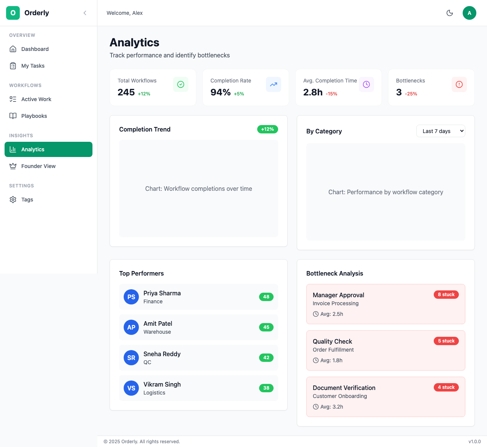
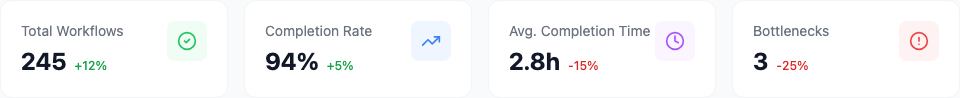

# Analytics & Reports

The Analytics page provides insights into your organization's workflow performance, helping you identify trends and make data-driven decisions.

## Table of Contents

- [Overview](#overview)
- [Dashboard Metrics](#dashboard-metrics)
- [Workflow Analytics](#workflow-analytics)
- [Task Analytics](#task-analytics)
- [Team Analytics](#team-analytics)
- [Custom Reports](#custom-reports)

---

## Overview


*The Analytics dashboard with key metrics*

Analytics helps you answer questions like:
- How quickly are workflows completing?
- Where are the bottlenecks?
- Which team members are most productive?
- Are we meeting our deadlines?

---

## Dashboard Metrics


*Key performance indicators*

### Key Performance Indicators

| Metric | Description | Goal |
|--------|-------------|------|
| **Workflow Completion Rate** | % of workflows finished | Higher is better |
| **Average Completion Time** | Time from start to finish | Lower is better |
| **On-Time Delivery** | % completed by due date | 95%+ |
| **Stuck Rate** | % of workflows that get stuck | Lower is better |

### Time Range Selection


*Select time period for analysis*

| Period | Shows |
|--------|-------|
| **Today** | Current day metrics |
| **This Week** | Last 7 days |
| **This Month** | Last 30 days |
| **This Quarter** | Last 90 days |
| **Custom** | Select specific dates |

---

## Workflow Analytics

### Completion Trends

Track how many workflows complete over time:

```
Workflows Completed
│
│    ████
│    ████ ████
│ ██ ████ ████ ████
│ ██ ████ ████ ████ ██
└──────────────────────────
  Week 1  2    3    4   5
```

### Workflow Status Distribution

See current workflow state breakdown:

| Status | Count | Percentage |
|--------|-------|------------|
| In Progress | 15 | 45% |
| Completed | 12 | 36% |
| Stuck | 4 | 12% |
| Not Started | 2 | 6% |

### Playbook Performance

Compare how different playbooks perform:

| Playbook | Avg. Time | Completion Rate | Stuck Rate |
|----------|-----------|-----------------|------------|
| Employee Onboarding | 5 days | 94% | 3% |
| Content Publishing | 2 days | 98% | 1% |
| Bug Fix Process | 1 day | 92% | 8% |

---

## Task Analytics

### Task Completion by Status

Track task flow through statuses:

| Stage | Tasks | Avg. Time |
|-------|-------|-----------|
| Locked → Available | 156 | 2.3 hrs |
| Available → In Progress | 142 | 0.5 hrs |
| In Progress → Completed | 138 | 4.1 hrs |

### Bottleneck Detection

Identify tasks that consistently block progress:

| Task Type | Avg. Wait Time | Frequency | Priority |
|-----------|----------------|-----------|----------|
| Legal Review | 3.2 days | High | 🔴 Critical |
| Manager Approval | 1.8 days | High | 🟡 Medium |
| Technical Setup | 0.5 days | Low | 🟢 Normal |

### Escalation Analysis

Track escalation patterns:

| Type | Count | Resolution Time |
|------|-------|-----------------|
| Overdue Tasks | 23 | 4.2 hrs avg |
| Stuck Workflows | 8 | 1.2 days avg |
| Reassignments | 12 | 2.1 hrs avg |

---

## Team Analytics

### Individual Performance

| Team Member | Completed | Avg. Time | On-Time % |
|-------------|-----------|-----------|-----------|
| Alice Smith | 45 tasks | 2.1 hrs | 98% |
| Bob Johnson | 38 tasks | 2.8 hrs | 94% |
| Carol Davis | 42 tasks | 2.3 hrs | 96% |

### Workload Distribution

Ensure fair task distribution:

```
Task Distribution
Alice  ████████████████████ 28%
Bob    ██████████████████ 26%
Carol  ████████████████ 24%
David  ██████████████ 22%
```

### Team Velocity

Track team productivity over time:

| Week | Tasks Completed | Workflows Finished |
|------|-----------------|-------------------|
| Week 1 | 145 | 12 |
| Week 2 | 158 | 14 |
| Week 3 | 162 | 15 |
| Week 4 | 171 | 16 |

---

## Custom Reports

### Creating Reports

1. Click **New Report**
2. Select metrics to include
3. Choose date range
4. Add filters (team, playbook, status)
5. Save and name your report

### Scheduling Reports

Set up automatic report delivery:

| Frequency | Delivery | Recipients |
|-----------|----------|------------|
| Daily | 9:00 AM | Team leads |
| Weekly | Monday 8:00 AM | Managers |
| Monthly | 1st of month | Executives |

### Export Options

Download reports in various formats:

| Format | Use Case |
|--------|----------|
| **PDF** | Presentations, sharing |
| **CSV** | Excel analysis |
| **JSON** | API integration |

---

## Role-Specific Views

### For Founders/Owners

Focus on:
- Organization-wide trends
- Cross-team comparisons
- Strategic bottlenecks
- ROI of process improvements

### For Managers

Focus on:
- Team performance
- Individual metrics
- Workload balance
- Process efficiency

### For Team Members

Focus on:
- Personal task history
- Completion trends
- Time tracking
- Performance comparison

---

## Best Practices

### Weekly Reviews

1. Check completion rates
2. Identify stuck workflows
3. Review escalations
4. Adjust assignments

### Monthly Analysis

1. Compare playbook performance
2. Identify improvement opportunities
3. Update processes based on data
4. Set new targets

### Quarterly Planning

1. Review long-term trends
2. Assess team capacity
3. Plan process improvements
4. Set quarterly goals

---

## Next Steps

- **[Team Management](/user-guide/08-team-management.md)** - Manage your team
- **[Tags & Organization](/user-guide/09-tags-organization.md)** - Organize with tags
- **[FAQ](/user-guide/10-faq.md)** - Common questions

---

*Need help? Contact your organization admin or visit our [FAQ](/user-guide/10-faq.md).*
