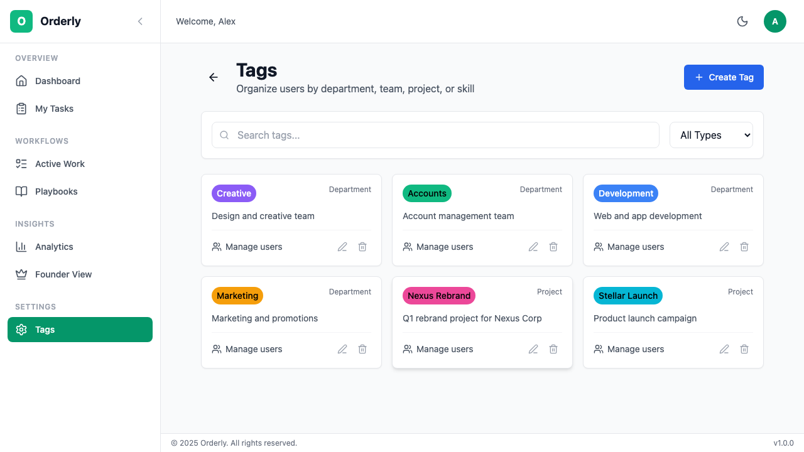

# Tags & Organization

Tags help you organize users, playbooks, and workflows in Orderly. Use them to represent departments, teams, projects, or any custom grouping.

## Table of Contents

- [Overview](#overview)
- [Understanding Tags](#understanding-tags)
- [Creating Tags](#creating-tags)
- [Using Tags](#using-tags)
- [Tag-Based Assignment](#tag-based-assignment)
- [Best Practices](#best-practices)

---

## Overview

Tags provide flexible organization for your workflows:

- **Group users** by department or team
- **Categorize playbooks** by project or type
- **Filter workflows** by relevant criteria
- **Assign tasks** to entire teams instead of individuals

---

## Understanding Tags

### Tag Types

| Type | Use Case | Examples |
|------|----------|----------|
| **Department** | Organizational units | Engineering, Marketing, HR |
| **Team** | Working groups | Frontend Team, Growth Squad |
| **Project** | Project-specific | Q4 Launch, Website Redesign |
| **Skill** | Capability-based | JavaScript, Design, Legal |
| **Custom** | Anything else | VIP Clients, Urgent, Archived |

### Tag Properties

Each tag has:

| Property | Description |
|----------|-------------|
| **Name** | Display name (e.g., "Engineering") |
| **Slug** | URL-safe identifier (e.g., "engineering") |
| **Color** | Visual identifier in UI |
| **Type** | Category of tag |
| **Description** | Optional explanation |

---

## Creating Tags

### Step 1: Navigate to Tags

1. Click **Settings** in the sidebar (Owner/Admin only)
2. Go to **Tags**


*Tags management page showing all organizational tags*

### Step 2: Create New Tag

1. Click **Create Tag**
2. Fill in the details:
   - **Name**: Display name
   - **Type**: Select category
   - **Color**: Choose a color
   - **Description**: Optional context
3. Click **Save**


*Click the highlighted button to create a new tag*

### Example Tags Setup

**For a marketing agency like Crescendo Digital:**

```
DEPARTMENTS
├── Creative (🟣 Purple) - Design and content team
├── Accounts (🔵 Blue) - Account managers and client relations
├── Development (🟢 Green) - Web development team
└── Marketing (🟠 Orange) - Marketing specialists

PROJECTS
├── Nexus Rebrand (🔴 Red) - Major client project
└── Stellar Launch (🟡 Gold) - Website launch campaign
```

**Team member tag assignments:**
| Team Member | Role | Tags |
|------------|------|------|
| Emma Garcia | Creative Director | Creative |
| Michael Brown | Senior Designer | Creative |
| James Wilson | Account Manager | Accounts |
| Lina Kim | Developer | Development |
| David Patel | Marketing Specialist | Marketing |

---

## Using Tags

### Tagging Users

Assign users to tags to indicate their team or department:

1. Go to **Team Management**
2. Click on a user
3. Click **Add Tags**
4. Select relevant tags
5. Save changes

**Multiple Tags:**
Users can have multiple tags:
- Emma Garcia: `Creative`, `Nexus Rebrand` (Creative Director on major project)
- Michael Brown: `Creative`, `Stellar Launch` (Designer on website launch)

### Tagging Playbooks

Categorize playbooks by project or department:

1. Open a playbook
2. Click **Edit**
3. Add tags in the **Tags** field
4. Save

**Benefits:**
- Filter playbooks by tag
- Assign to team-specific workflows
- Organize your library

### Filtering by Tags

Use tags to quickly find what you need:

**On the Playbooks page:**
- Click the tag filter dropdown
- Select one or more tags
- See only matching playbooks

**On the Workflows page:**
- Filter instances by tag
- Focus on your team's work

---

## Tag-Based Assignment

### Assigning Tasks to Tags

Instead of assigning tasks to specific users, assign them to tags:

**Example:**
```
Task: "Code Review"
Assigned to: Tag:Frontend Team (instead of specific person)
```

**How it works:**
1. Task is created with a tag assignment
2. Any user with that tag can start the task
3. First person to start "owns" it
4. Others see it as in-progress

### Benefits of Tag Assignment

| Benefit | Description |
|---------|-------------|
| **Flexibility** | Anyone on the team can pick up work |
| **Load balancing** | Work distributes naturally |
| **No bottlenecks** | Absences don't block progress |
| **Scalability** | Add team members without updating playbooks |

### Setting Up Tag Assignment

In the playbook editor:

1. Select a task
2. Choose **Assignee Type**: Tag
3. Select the tag (e.g., "Engineering")
4. Save playbook

When the workflow runs:
- Task shows as assigned to "Engineering"
- Any Engineering member can start it

---

## Best Practices

### Naming Conventions

| ✅ Good | ❌ Avoid |
|---------|----------|
| Engineering | eng |
| Frontend Team | FE |
| Q4 Product Launch | Q4 |
| Customer Support | Support Team Help |

Keep names:
- Clear and descriptive
- Consistent in format
- Not too abbreviated

### Color Coding

Use consistent colors:

| Color | Suggested Use |
|-------|---------------|
| 🔵 Blue | Technical teams |
| 🟢 Green | Customer-facing |
| 🟣 Purple | Creative/Marketing |
| 🟠 Orange | Operations |
| 🔴 Red | Urgent/Priority |
| ⚪ Gray | Archived/Inactive |

### Hierarchy Planning

Plan your tag structure before creating:

1. **Departments first** - Main organizational units
2. **Teams second** - Groups within departments
3. **Projects third** - Cross-functional initiatives
4. **Skills last** - Optional, for specialized routing

### Maintenance

- **Review quarterly** - Remove unused tags
- **Merge similar** - Consolidate redundant tags
- **Update users** - Keep assignments current
- **Document usage** - Team guidelines for tagging

---

## Troubleshooting

<details>
<summary><strong>User can't see tag-assigned tasks</strong></summary>

Check if:
1. User has the correct tag assigned
2. Tag is spelled correctly on both ends
3. User has active status

</details>

<details>
<summary><strong>Too many tags showing up</strong></summary>

Consider:
1. Archiving unused tags
2. Merging similar tags
3. Using hierarchical naming (e.g., "Eng: Frontend")

</details>

<details>
<summary><strong>Task assigned to wrong tag</strong></summary>

1. Open the workflow
2. Click on the task
3. Change the tag assignment
4. Save changes

</details>

---

## Next Steps

- **[Team Management](./08-team-management.md)** - Assign tags to users
- **[Playbooks](./03-playbooks.md)** - Tag your workflow templates
- **[FAQ](./10-faq.md)** - Common questions

---

*Need help? Contact your organization admin or visit our [FAQ](./10-faq.md).*
