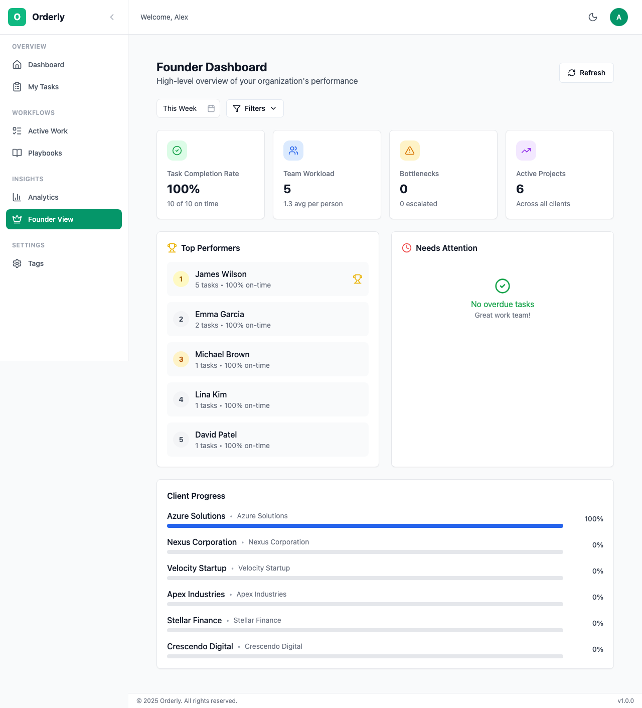
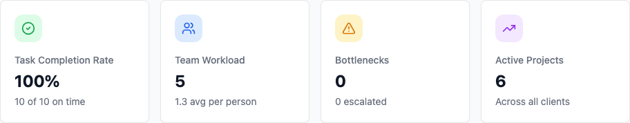
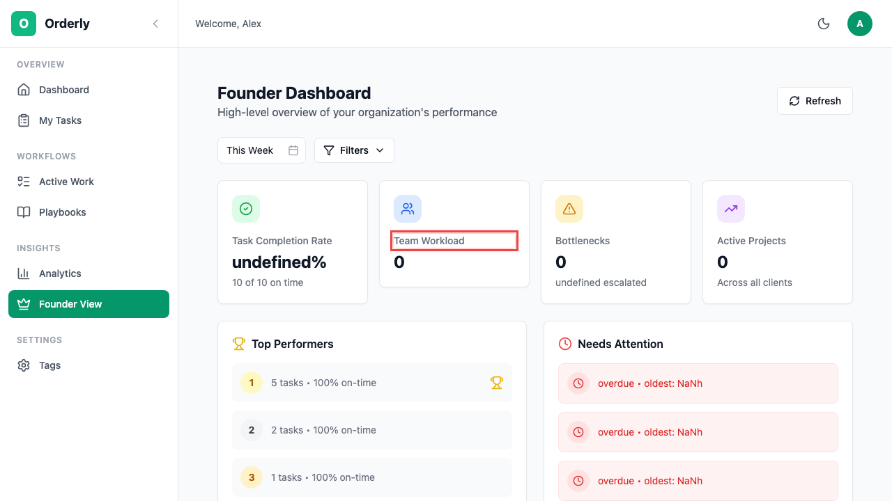
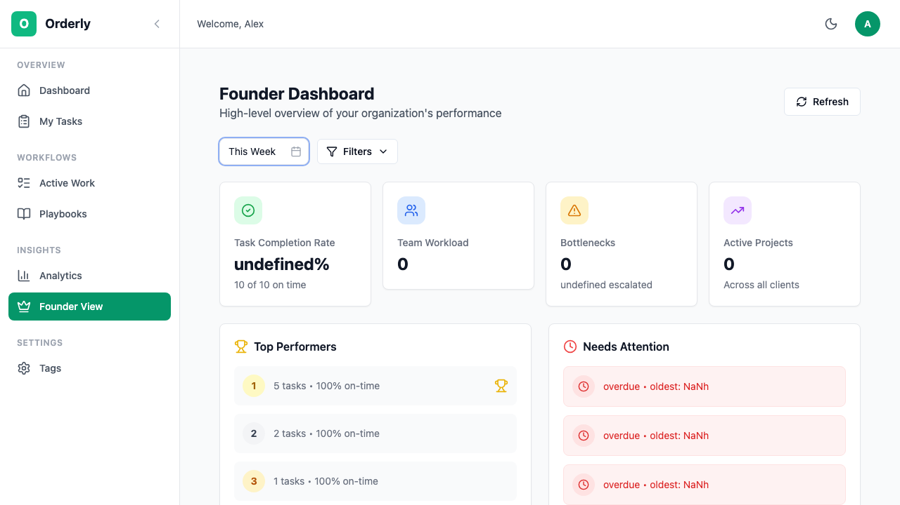
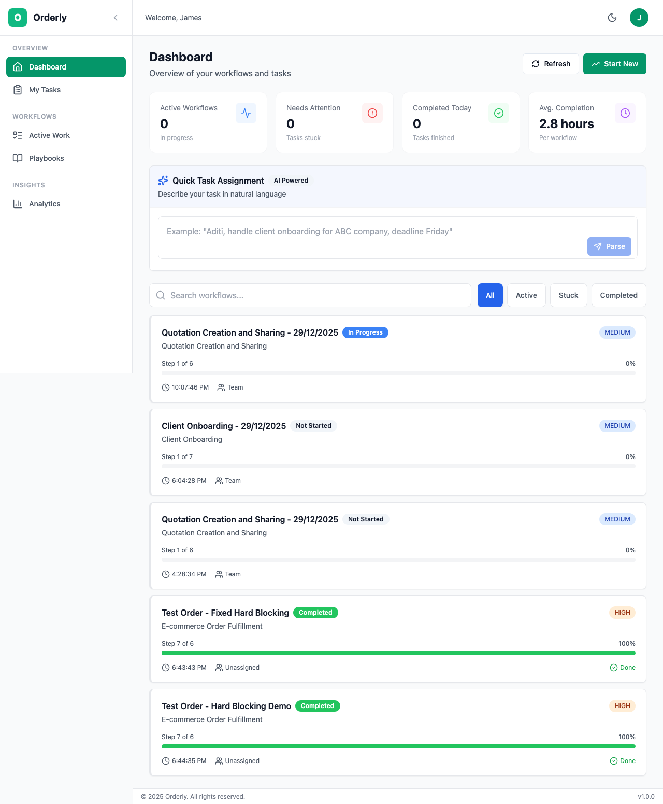

# Founder Dashboard

The Founder Dashboard provides organizational oversight and executive-level insights for business owners and administrators.

## Table of Contents

- [Overview](#overview)
- [Accessing the Dashboard](#accessing-the-dashboard)
- [Key Metrics](#key-metrics)
- [Team Performance](#team-performance)
- [Filtering & Analysis](#filtering--analysis)
- [Meeting View](#meeting-view)
- [Best Practices](#best-practices)

---

## Overview

The Founder Dashboard is designed for organizational leaders who need:

- **Bird's-eye view** of all workflows across the organization
- **Team performance metrics** to identify top performers and bottlenecks
- **Client/project tracking** for business oversight
- **Meeting-ready reports** for standup and review sessions

> **Note:** This dashboard is only accessible to users with **Owner** or **Admin** roles.

*The Founder Dashboard showing KPIs, team performance, and workflow overview*

---

## Accessing the Dashboard

### Desktop

1. Look for **Founder** in the sidebar navigation (visible for Owners/Admins only)
2. Click to open the Founder Dashboard

### Mobile

1. Tap the **Crown** icon in the bottom navigation
2. This icon only appears for Owner/Admin users

---

## Key Metrics

The dashboard displays four primary KPI cards at the top:

*Key Performance Indicators at a glance*

| Metric | Description | What to Watch |
|--------|-------------|---------------|
| **Task Completion Rate** | % of tasks completed on time | Below 80% indicates process issues |
| **Team Workload** | Tasks per user, highlighting max/min | Uneven distribution needs attention |
| **Bottlenecks** | Tasks stuck or overdue | High count requires immediate action |
| **Avg. Workflow Duration** | Time from start to completion | Increasing trends need investigation |

### Understanding the Metrics

**Task Completion Rate**
- Calculated as: `(Completed on time / Total completed) * 100`
- Green (90%+): Excellent
- Yellow (70-89%): Needs attention
- Red (below 70%): Critical

**Team Workload**
- Shows distribution of active tasks across team members
- Highlights who's overloaded and who has capacity
- Useful for reassignment decisions

**Bottlenecks**
- Counts tasks with `stuck` or `overdue` status
- Click to drill down into specific blocked items
- Often indicates process or assignment issues

---

## Team Performance

### Leaderboard

*Team performance ranking*

The leaderboard shows:
- **Top Performers**: Users with highest completion count and on-time rate
- **Activity Trend**: Tasks completed this period vs. previous
- **Current Workload**: Active tasks assigned

**Example from Crescendo Digital:**

| Rank | Team Member | Tasks Completed | On-Time Rate |
|------|-------------|-----------------|--------------|
| 1 | Emma Garcia | 24 | 95% |
| 2 | Michael Brown | 21 | 92% |
| 3 | James Wilson | 18 | 89% |
| 4 | Lina Kim | 16 | 94% |
| 5 | David Patel | 14 | 88% |

### Needs Attention

Tactfully displayed section showing:
- Users with highest overdue task count
- Long-running tasks that may be stuck
- Workflows awaiting action

---

## Filtering & Analysis

### Three-Level Filtering

Use filters to focus on specific segments of your organization:

*Filter dropdown showing team selection options*

| Filter | Options | Use Case |
|--------|---------|----------|
| **By Team** | Creative, Accounts, Development, Marketing | Department-specific analysis |
| **By Project** | Nexus Rebrand, Stellar Launch | Project-level oversight |
| **By Client** | Nexus Corporation, Stellar Finance | Client-specific reviews |

### Date Range Selection

Analyze performance over different time periods:

- **Today**: Daily standup preparation
- **This Week**: Weekly team meeting
- **This Month**: Monthly business review
- **Custom Range**: Specific period analysis

---

## Meeting View

Toggle between **Overview** and **Meeting View** for presentation-ready displays.

### Overview Mode (Default)

Full dashboard with all metrics and detailed breakdowns.

### Meeting View Mode

Simplified display optimized for screen sharing:
- Larger fonts and cleaner layout
- Key stats prominently displayed
- Highlights and concerns summary
- Upcoming deadlines list

**Ideal for:**
- Daily standups (Today filter)
- Weekly team meetings (Week filter)
- Monthly business reviews (Month filter)
- Client progress updates (Client filter)

---

## Best Practices

### Daily Routine

1. **Morning check** - Review bottlenecks first thing
2. **Identify blocks** - Address stuck tasks immediately
3. **Balance workload** - Reassign if someone's overloaded

### Weekly Review

1. **Compare to last week** - Identify trends
2. **Celebrate wins** - Acknowledge top performers
3. **Address patterns** - Recurring bottlenecks need process changes

### Monthly Analysis

1. **Client health** - Review completion rates by client
2. **Team capacity** - Adjust hiring or allocation
3. **Process improvements** - Update playbooks based on data

### Red Flags to Watch

| Signal | Possible Cause | Action |
|--------|---------------|--------|
| Completion rate dropping | Process too complex | Simplify playbooks |
| One person always overloaded | Poor distribution | Redistribute or hire |
| Same task type always stuck | Training gap | Provide support/training |
| Client workflows delayed | Unclear requirements | Improve intake process |

---

## Role Comparison: Different Views

Different roles see different navigation options:

### Owner View

*Full access including Founder Dashboard*

### Member View

*Focused on personal tasks - no Founder Dashboard access*

---

## Next Steps

- **[Analytics](/user-guide/07-analytics.md)** - Deeper reporting and trends
- **[Team Management](/user-guide/08-team-management.md)** - Manage users and roles
- **[Tags & Organization](/user-guide/09-tags-organization.md)** - Organize by department/project
- **[Tasks](/user-guide/05-tasks.md)** - Task management details

---

*Need help? Contact your organization admin or visit our [FAQ](/user-guide/10-faq.md).*
